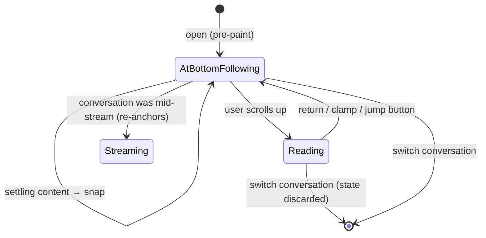

# Conversations and loading

Opening a conversation, switching between them, shared links, and resumed streams.

## Summary

A conversation opens at the bottom, following, before the first paint — no visible scroll to get there. Content that keeps inflating after load (markdown, images, highlighted code) is absorbed by follows, so the view stays at the bottom without playing animations. Switching conversations resets: instantly at the new one's bottom, following, with no anchored turn carried over. A conversation whose reply is still streaming resumes following it; a shared conversation is the same experience minus the ability to write.

## The simple case

The user clicks a conversation in the sidebar. The messages appear already scrolled to the bottom; over the next moments images and code blocks pop in above, and the view remains exactly at the bottom throughout — no gliding, no creep. They scroll up to skim, click another conversation, come back: bottom again, following again; their old reading position is not remembered.

## The interaction, event by event

Loading is not a turn; the phase vocabulary applies only when a stream is involved:

- **Open.** The view is placed at the bottom before first paint, following. Settling content (async markdown, images) triggers follows — snaps — so the bottom stays the bottom. Nothing is animated: settling plays no motion, only stillness at the bottom.
- **Switch.** Same as open, plus teardown of session scroll state: the anchored turn clears, so the switched-to conversation shows no reservations. Switching back does not restore them.
- **Resume.** If the opened conversation has a reply still streaming (or parked mid-stream awaiting a tool confirmation), the trailing turn anchors as streaming proceeds and the experience continues as [streaming and reading](streaming-and-reading.md).

## Modifiers

| Modifier           | At the start                                                                                                                                                      | Changed during |
| ------------------ | ----------------------------------------------------------------------------------------------------------------------------------------------------------------- | -------------- |
| Touch device       | Identical                                                                                                                                                         | n/a            |
| Reduced motion     | Identical — loading already avoids motion                                                                                                                         | n/a            |
| Hidden tab         | Loads and settles correctly unseen                                                                                                                                | n/a            |
| Read-only / shared | Identical open behavior; a shared conversation with artifacts may auto-open the panel (desktop), narrowing the column — settling reflow is followed at the bottom | n/a            |
| Artifact panel     | The panel resets on a conversation switch, like scroll state                                                                                                      | n/a            |

## Cancel and interrupt

- **Stop button:** n/a while loading; for a resumed stream, as in streaming.
- **User does something else mid-way:** scrolling up during settle detaches; late content above is compensated so their text holds still. Switching again mid-settle is fine — state is per-conversation-visit and rebuilt from scratch.
- **Clean complete:** settle has no marked end; the view is simply at the bottom, still.
- **Environment failing:** a conversation that fails to load shows the error surface; no scroll state to speak of.
- **Page going away:** reload = open. Scroll position is deliberately not persisted; the bottom is the home position of a conversation.
- **Something else changing the target:** a conversation updated elsewhere (another tab) shows its new content on next open; there is no live cross-tab following.
- **Input channel changing:** n/a.

## Interactions with other systems

**Composer:** a drafted-but-unsent message survives navigation per conversation; a tall restored draft raises the clearance before first paint, and the pre-paint bottom placement accounts for it. **Viewport:** none special. **Reduced motion / hidden tabs:** see modifiers. **Gutter:** measured at open; see cross-cutting. **Shared conversations:** see modifiers. **Artifact panel:** resets on switch; a shared conversation may auto-open it.

## Edge cases

- **The home screen → first send** navigates to the new conversation's route mid-turn. The reset lands at the bottom and the turn re-anchors immediately; the user sees one continuous send, not a reset.
- **A conversation shorter than the view** has no scrolling; it is trivially "at the bottom, following", and the first overflow follows.
- **Empty conversations** (a pending first reply from a navigation) show the placeholder from the top; following begins with the first real content.
- **Back/forward navigation** between conversations behaves exactly like sidebar switches; there is no scroll restoration, deliberately overriding the browser's default for this pane.

## Open questions and verification

Verified against the commit that introduced this document, by `chatScroll.svelte.test.ts` (reset on switch, no-glide settle, anchor cleared) and by hand for pre-paint placement. Open: whether long-conversation reopening should eventually restore the last reading position instead of the bottom — a product question outside this rework's scope, noted here because the reset behavior is where it would land.
