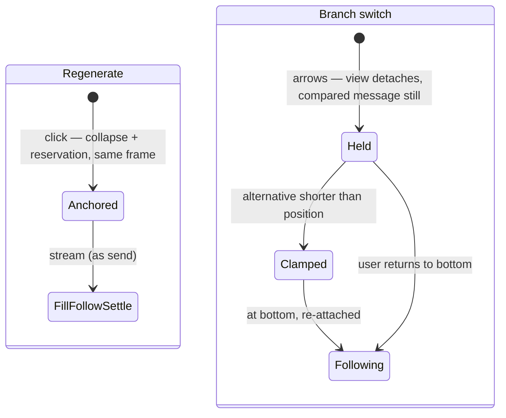

# Regenerating and branches

Regenerate, edit-and-send, and the ‹ › branch arrows: structure changes to existing turns, and what the view does about them.

## Summary

Regenerating replaces a reply in place: the old reply collapses inside its turn's reservation and the new one streams into the same space, so the exchange re-anchors without the collapse itself jolting anything. Regenerating from a reading position far above never moves the view. The branch arrows compare alternatives: the compared message holds still, whatever the alternative's length. Edit-and-send is a send and lives in [sending a message](sending-a-message.md).

## The simple case

The reply wasn't right; the user clicks regenerate under it, at the bottom of the conversation. The old reply clears out of the turn, the sent message sits (or glides to) 50px below the top exactly as it did the first time, and the fresh reply streams into the blank space below.

## The interaction, event by event

For regenerate, the turn phases replay in place:

- **Arming.** Regenerate is clicked (the retry button under a reply, or the error bar's Try again). Unlike send, arming does _not_ move a detached view — regenerating is a request for new content, not a request to see it; the user who scrolled up stays put.
- **Anchoring.** The turn becomes the anchored turn in the same frame the old reply collapses. The reservation holds the turn's box open, so the collapse is invisible: page height at the bottom is unchanged (or grows, if the turn had never been anchored and its content was shorter than a reservation — growth below the fold, silent for a detached reader, followed for an attached one). A view following at the bottom is carried to the anchor position by the follow; a detached view does not move at all.
- **Filling / Following / Settling.** Identical to a send from here on.

For a branch switch (‹ › arrows on a user or assistant message):

- The tail of the conversation from that message on is replaced by the alternative. The moment the switch happens, the view stops following — the user is comparing, and the compared message must hold still. Content above the switch point is untouched, so simply not moving keeps it stationary.
- If the alternative is shorter and the parked position no longer exists, the view is clamped to the new bottom and re-attaches ([scroll model](../foundations/scroll-model.md)).
- The view does not re-attach otherwise; the user returns to the bottom on their own terms.

## Modifiers

| Modifier           | At the start                                                                                                    | Changed during |
| ------------------ | --------------------------------------------------------------------------------------------------------------- | -------------- |
| Touch device       | Identical (no glide is involved in regenerate-at-bottom: the follow carries the view)                           | n/a            |
| Reduced motion     | Identical                                                                                                       | n/a            |
| Hidden tab         | Structure changes apply; the view is correct on return                                                          | n/a            |
| Read-only / shared | Regenerate and edit are unavailable; branch arrows work and behave as above                                     | n/a            |
| Artifact panel     | An alternative containing different artifact versions updates the panel; the conversation view behaves as above | Same           |

## Cancel and interrupt

- **Stop button:** stops the regenerated stream; reservation kept, view stays.
- **User does something else mid-way:** scrolling up during a regenerated stream detaches, as always. Switching branches or regenerating again is disabled until the stream ends. Sending during a regenerated stream is likewise unavailable.
- **Clean complete:** the branch switch itself is instantaneous — its "complete" is the swap; regenerate completes as a normal settle.
- **Environment failing:** a failed regenerate settles the turn with the error bar; the reservation (opened at anchoring) is kept, so the failed state is as still as a successful one.
- **Page going away:** after a reload, the regenerated reply (or its error) is simply part of the loaded conversation; no turn is anchored.
- **Something else changing the target:** cycling the anchored turn's reply alternatives keeps its reservation, so alternatives of different lengths compare inside a stable box; switching to a branch with a different trailing turn drops the reservation. Either way the compared message holds still, and only a clamp can move the view.
- **Input channel changing:** nothing specific; positions rule, as everywhere.

## Interactions with other systems

**Composer:** unchanged by structure changes; clearance math is the same. **Viewport:** unchanged. **Reduced motion / hidden tabs:** see modifiers. **Gutter:** none. **Shared conversations:** arrows only, as above. **Artifact panel:** see modifiers.

## Edge cases

- **Regenerate from far above on a freshly loaded conversation** (turn never anchored, old reply taller than the view): the old content collapses into a reservation-sized box — a shrink entirely below the reader's fold; they do not move. This is surprising only in how unremarkable it is: before this rework it required dedicated intent tracking, and a mistimed frame could visibly jump.
- **Regenerating the only turn** of a one-turn conversation behaves the same; the reservation covers the collapse.
- **Rapid arrow clicks** through many alternatives: each swap holds the compared message still; no queued animations exist to pile up.
- **An alternative that ends in an unfinished, empty reply** (a branch abandoned before its first token) is just content: switching to it shows the empty reply, moves nothing, and — being empty and never streaming — anchors nothing.

## Open questions and verification

Verified against the commit that introduced this document, by `chatScroll.svelte.test.ts` (regenerate-from-above stillness, regenerate-at-bottom re-anchor, branch-switch hold and clamp, empty-alternative case). Open: whether branch arrows should re-attach when used _at_ the bottom on a longer alternative (currently: view holds, bottom of the longer alternative is below the fold until the user scrolls or the clamp rule has no occasion to fire) — flagged for product review in [bug-triage.md](../bug-triage.md).
