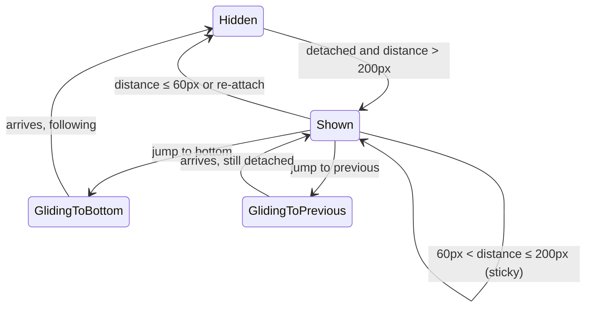

# The jump buttons

The two floating buttons that appear while reading away from the bottom.

## Summary

While the user reads away from the bottom, two round buttons float at the lower right: **jump to bottom** glides to the live bottom and re-attaches; **jump to previous** glides the previous user message to the top of the view and stays detached. They exist only when useful — never while following, appearing past 200px of distance and disappearing within 60px — and their thresholds are sticky so they never flicker at the boundary.

## The simple case

Mid-stream, the user scrolls up three screens. Both buttons fade in at the lower right. They click jump to bottom: the view glides down — chasing the still-growing bottom — lands on it, re-attaches, and the buttons fade out.

## The interaction, event by event

The buttons are companions to the **following/detached** loop rather than turn phases:

- **Appearing.** Both buttons require being detached with more than 200px of distance from the bottom. Jump to previous additionally requires being scrolled more than 200px down from the top (near the very top there is no "previous" left to reveal). While following, the buttons never show — not even transiently during send glides or fast growth.
- **Jump to bottom.** One click: re-attach now, then glide to the bottom. The target is live — during streaming the glide lands on the _current_ bottom, never short. Jumps longer than 2500px teleport to 1200px out and glide the rest. An upward scroll mid-glide cancels and detaches, as always.
- **Jump to previous.** One click: glide so the nearest user message above the top of the view lands 50px below the top (the same offset as an anchored turn — turn starts are the skimming landmarks). The view stays detached: this is a reading move, not a return. Repeated clicks walk turn by turn toward the beginning. If no user message is above the view, the nearest message of any kind is used; if none, the click does nothing.
- **Disappearing.** Buttons hide when the distance falls to 60px or below, or the view re-attaches for any reason. Between 60px and 200px, buttons keep whatever visibility they had (the sticky band that prevents flicker).

## Modifiers

| Modifier           | At the start                                                     | Changed during                                          |
| ------------------ | ---------------------------------------------------------------- | ------------------------------------------------------- |
| Touch device       | Identical; the buttons are the reliable way back down mid-stream | n/a                                                     |
| Reduced motion     | Both jumps are instant                                           | n/a                                                     |
| Hidden tab         | n/a (nothing to click)                                           | A jump initiated just before hiding completes instantly |
| Read-only / shared | Identical                                                        | n/a                                                     |
| Artifact panel     | Buttons stay at the conversation column's lower right            | n/a                                                     |

## Cancel and interrupt

- **Stop button:** unrelated; a jump-to-bottom glide simply stops chasing growth that has stopped.
- **User does something else mid-way:** upward scroll during either glide cancels it and detaches. Clicking jump to previous during a jump-to-bottom glide (or vice versa) replaces the motion with the new one.
- **Clean complete:** arrival; jump to bottom ends following, jump to previous ends detached at the offset.
- **Environment failing:** n/a.
- **Page going away:** n/a; buttons are derived state and reappear from geometry after reload.
- **Something else changing the target:** content shrinking during a jump-to-bottom glide shortens the trip (live target); a clamp mid-glide simply arrives early. During jump to previous, the target message is above the fold and does not move.
- **Input channel changing:** n/a.

## Interactions with other systems

**Composer:** buttons float above it, offset so neither is occluded. **Viewport:** thresholds are distances, unaffected by size. **Reduced motion:** instant jumps. **Gutter:** buttons are outside the scrolling content. **Shared conversations:** identical. **Artifact panel:** see modifiers.

## Edge cases

- In a conversation shorter than ~200px of overflow the buttons can never appear; nothing is lost — the bottom is a flick away.
- Jump to previous with the view already exactly at a user message's offset walks to the one before it (strictly above the top counts, with a 1px tolerance).
- The show threshold is measured from live geometry, so growth while detached can push a stationary reader past 200px and reveal the buttons without any scroll of theirs — correct: their distance from the newest content did grow.

## Open questions and verification

Verified against the commit that introduced this document, by `chatScroll.svelte.test.ts` (hysteresis, hidden-while-following incl. send glide, jump-to-previous landing offset and detachment) and `stickToBottom.svelte.test.ts` (live-target chase, long-jump teleport). Open: none.
