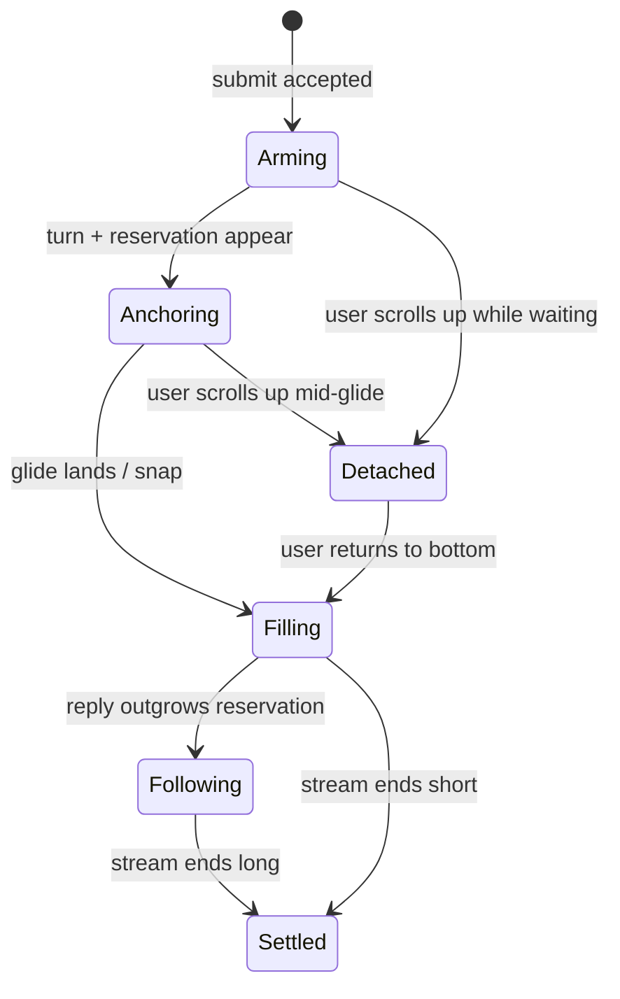

# Sending a message

What happens to the view between pressing Send and the reply's first tokens, for plain sends and for edit-and-send.

## Summary

Sending a message carries the view to the new exchange: the sent message glides to 50px below the top of the view, blank space opens beneath it, and the reply streams into that space without moving anything. Send is the one moment the product moves the view on the user's behalf even if they were reading elsewhere — pressing Send _is_ the request to see the exchange — but the user can take the view back at any instant, including mid-glide.

## The simple case

In an ongoing conversation, following, on a laptop: the user types and presses Enter. The draft clears, the composer shrinks back to one line, and the view glides down as the new exchange appears — the sent message settles 50px below the top, blank to the composer below it. The first tokens appear at the top of the blank space. Nothing else on screen so much as twitches.

## The interaction, event by event

- **Arming.** The submit is accepted (Enter, the send button, an example chip, a preview's "ask to fix", or submitting an edit). The view begins moving to the bottom at once: a glide on fine pointers, a snap on touch devices. At this instant the exchange does not exist yet — the glide is toward the current bottom.

  > Technical note: on touch devices the move is a snap because iOS suppresses smooth programmatic scrolling during touch and momentum and replays it when the gesture settles, which would visibly scroll the view long after the tap.

- **Anchoring.** The new turn — sent message plus empty reply — appears, together with its [reservation](../foundations/turn-reservation.md), usually within the same instant; with attachments, after they finish encoding (a placeholder reply may bridge the gap at the bottom). The still-running glide's target has now moved: it carries on smoothly to the new bottom, which by construction places the sent message at the anchor offset. On touch, the follow snaps there instead. There is no second animation — arming's move and anchoring's move are one continuous motion.
- **Filling.** Tokens stream into the reservation; the view is motionless. See [the turn reservation](../foundations/turn-reservation.md).
- **Following.** If the reply outgrows the reservation, the view follows growth with snaps. See [the scroll model](../foundations/scroll-model.md).
- **Settling.** The stream ends; the view stays where following left it. No end-of-turn correction of any kind.

## Modifiers

| Modifier               | At the start                                                                                                          | Changed during                         |
| ---------------------- | --------------------------------------------------------------------------------------------------------------------- | -------------------------------------- |
| Touch device           | Snap to bottom instead of glide, at arming and anchoring                                                              | n/a                                    |
| Reduced motion         | All moves are snaps                                                                                                   | Next move                              |
| Hidden tab             | Moves are instant; a send from another surface into a hidden tab lands followed                                       | On return, the view is already correct |
| Read-only conversation | Sending is disabled; no interaction                                                                                   | n/a                                    |
| Artifact panel         | Unchanged; if a streaming artifact auto-opens the panel, the column narrows and reflow is absorbed by the reservation | Same                                   |

## Cancel and interrupt

- **Stop button:** stops the stream; the view settles wherever it is. Stopping during arming (before the turn appears) leaves the conversation as it was; the glide, having re-attached the view, leaves it following at the bottom.
- **User does something else mid-way:** an upward scroll at _any_ point — during the arming glide, during anchoring, during fill — cancels any motion and detaches; the exchange continues below the fold and nothing yanks the user back. This is the revocation rule: pressing Send grants one move to the exchange, and any upward scroll revokes it. Switching branches or regenerating during a send is not possible (the controls are disabled while streaming). Sending again is possible only after this stream ends.
- **Clean complete:** see Settling.
- **Environment failing:** if the request fails before the turn appears, the view is simply at the bottom (the glide completed; nothing else happens). If it fails mid-stream, the turn settles with an error bar below it; the view does not move.
- **Page going away:** a reload during streaming loads the conversation fresh (see [conversations and loading](../features/conversations-and-loading.md)) and resumes the stream if it is still running server-side; the resumed turn re-anchors.
- **Something else changing the target:** not applicable during a send — the sent turn is the newest thing in the conversation and nothing else mutates it.
- **Input channel changing:** the virtual keyboard typically closes on mobile send; the view height grows, the reservation grows with it, and the anchored message keeps its offset (see [composer, viewport and gutter](../cross-cutting/composer-viewport-gutter.md)). Sending from a hardware keyboard while scrolled with touch behaves identically to any send.

## Interactions with other systems

**Composer:** clearing the draft shrinks the composer, which shrinks the clearance and enlarges the reservation by the same amount — total height unchanged, no motion. **Viewport:** see keyboard note above. **Reduced motion / hidden tabs:** snaps, as everywhere. **Gutter:** unchanged. **Shared conversations:** cannot send. **Artifact panel:** see modifiers.

## Edge cases

- **Send while detached, far up:** the view still comes down (send means "show me"), as one glide from wherever the user was; distances beyond 2500px teleport most of the way first.
- **Edit-and-send** behaves exactly like send: the edited exchange is a fresh turn at the end of the visible branch and anchors identically.
- **Send with large attachments:** arming's glide reaches the current bottom and waits (following); the turn appears when encoding finishes and the follow carries the view to the anchor. The wait shows a placeholder reply at the bottom.
- **First message of a brand-new conversation:** identical anchoring; the page navigates from the home screen to the conversation route mid-turn, which resets and re-anchors in place — not observable as motion.
- **Two rapid sends** (second submit as soon as the first stream ends): the anchor simply moves to the newest turn; the previous turn's leftover blank space sits above the new exchange, out of view.

## Open questions and verification

Verified against the commit that introduced this document, by `chatScroll.svelte.test.ts` (anchor offset, revocation by mid-flight scroll, touch snap path, attachment-delay path) and by hand in the running product for feel and timing. Open: none.
