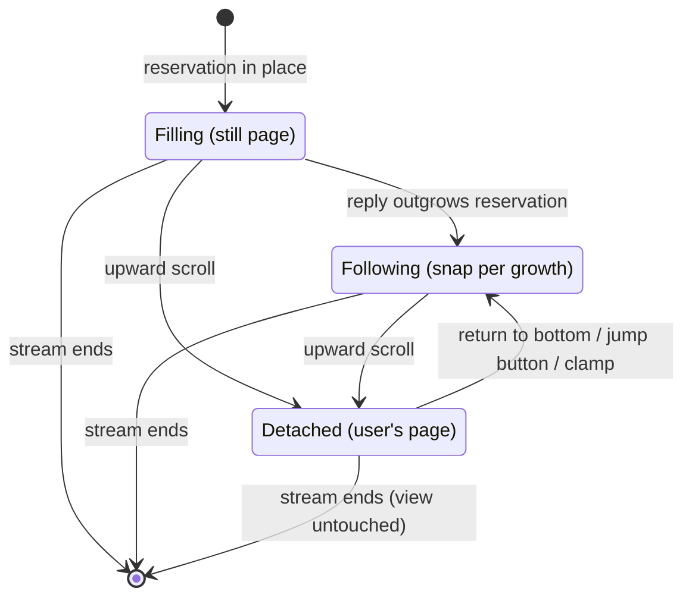

# Streaming and reading

The experience while a reply streams: following it, leaving to read, and coming back.

## Summary

While a reply streams, the view either shows the newest content (following) or stays exactly where the user put it (detached). The user moves freely between the two: any upward scroll detaches, scrolling back to the bottom re-attaches. The product's motion is honest — it tracks content growth one-for-one, plays easing only for moves the user asked for, and never repositions the view for its own reasons.

## The simple case

A long reply is streaming past its reservation; the view follows, each token batch nudging the page up in step. The user wheels up two screens to re-read the question; the view is instantly theirs and holds still while the reply keeps growing below (the jump buttons fade in at the lower right). They read, then scroll back down; as they come within 60px of the bottom the view re-attaches and glides the remainder closed, and following resumes.

## The interaction, event by event

This document covers the **filling**, **following**, and **settling** phases of a turn (arming and anchoring belong to [sending a message](sending-a-message.md)).

- **Filling.** The view is motionless while the reply fills its reservation. Reading during fill is reading a still page: scrolling up detaches (which changes nothing visually — nothing was moving), and returning to the bottom re-attaches. The scrollbar is still too, because the page height is constant.
- **Following.** Growth past the reservation moves a following view down in same-frame snaps. Chunky growth — a code block swapping in its highlighted form, an image arriving — moves it by that chunk: the motion equals the content change, no more, no less. A detached view never moves; growth below the fold is silent, and growth _above_ a detached reader is compensated so their text holds still ([scroll model](../foundations/scroll-model.md)).
- **Settling.** The stream ends. Nothing moves — not now, not when the conversation is silently reconciled with the server's canonical copy a moment later, and not when the final markdown pass, syntax highlighting, or late images land afterwards, so long as the view is where following left it (at the bottom, those late changes are followed like any growth; detached, they are compensated or silent). There is no end-of-stream scroll correction.

## Modifiers

| Modifier           | At the start                                                                                                                                        | Changed during                                                       |
| ------------------ | --------------------------------------------------------------------------------------------------------------------------------------------------- | -------------------------------------------------------------------- |
| Touch device       | Identical; momentum scrolling detaches and re-attaches by position like any scroll                                                                  | Mid-momentum growth never steals the gesture                         |
| Reduced motion     | Following is already snap-based; re-attach catch-up becomes a snap too                                                                              | Next move                                                            |
| Hidden tab         | Following continues synchronously; on return the view is at the live bottom with no replayed animation                                              | Same                                                                 |
| Read-only / shared | No streaming occurs                                                                                                                                 | n/a                                                                  |
| Artifact panel     | A streaming artifact renders as a card in the conversation while its code streams in the panel; the conversation column follows its own growth only | Panel toggling reflows the column; following snaps, detached anchors |

## Cancel and interrupt

- **Stop button:** growth ends; both states simply stop changing. No motion.
- **User does something else mid-way:** detach and re-attach are the core loop (above). Branch arrows and regenerate are disabled while streaming. Switching conversations mid-stream leaves this one (see [conversations and loading](conversations-and-loading.md)); switching back re-attaches at the bottom and, if the stream still runs, resumes following it.
- **Clean complete:** see Settling.
- **Environment failing:** a dropped stream behaves like Stop plus an error bar under the turn; no motion. A hidden tab: see modifiers.
- **Page going away:** reload mid-stream reloads at the bottom, following; a still-running generation resumes streaming into a re-anchored turn.
- **Something else changing the target:** nothing else can change the streaming turn. Late inflation of _earlier_ messages (images above) is compensated for detached readers and followed for attached ones.
- **Input channel changing:** find-in-page jumping upward detaches (the view moved up); jumping downward to the bottom re-attaches. Keyboard PageUp/Home detach; End re-attaches by landing at the bottom. The virtual keyboard: see cross-cutting.

## Interactions with other systems

**Composer:** typing a draft mid-stream grows the composer; clearance and reservation trade exactly, so a following view does not move during fill, and past the reservation the extra clearance is followed as growth. **Viewport:** window resizes re-follow when following; the reservation recomputes. **Reduced motion and hidden tabs:** see modifiers. **Gutter:** none. **Shared conversations:** n/a. **Artifact panel:** see modifiers.

## Edge cases

- Wheeling up **inside a code block** that can scroll further up scrolls the code block only; the conversation stays following. When the block hits its top, further wheeling reaches the conversation and detaches it. Same for tables and anything else scrollable.
- **Selection auto-scroll** (dragging a selection above the viewport) moves the view up and therefore detaches — the user is doing something; the product yields.
- A reply that **shrinks** mid-stream (a collapsing reasoning section) under a detached reader either leaves them in place or clamps to the bottom and re-attaches; a following view stays at the bottom throughout.
- **Very fast streams** on slow machines: follows coalesce naturally (one snap per rendered frame); the view is at the live bottom of whatever has rendered.

## Open questions and verification

Verified against the commit that introduced this document, by `stickToBottom.svelte.test.ts` (continuous-stream glue, detach under every input kind, re-attach and catch-up, inner-scrollable wheel, clamp-vs-stationary shrink, anchoring compensation, CLS probe, fuzz) and `chatScroll.svelte.test.ts` (fill stillness, handoff). Open: none.
