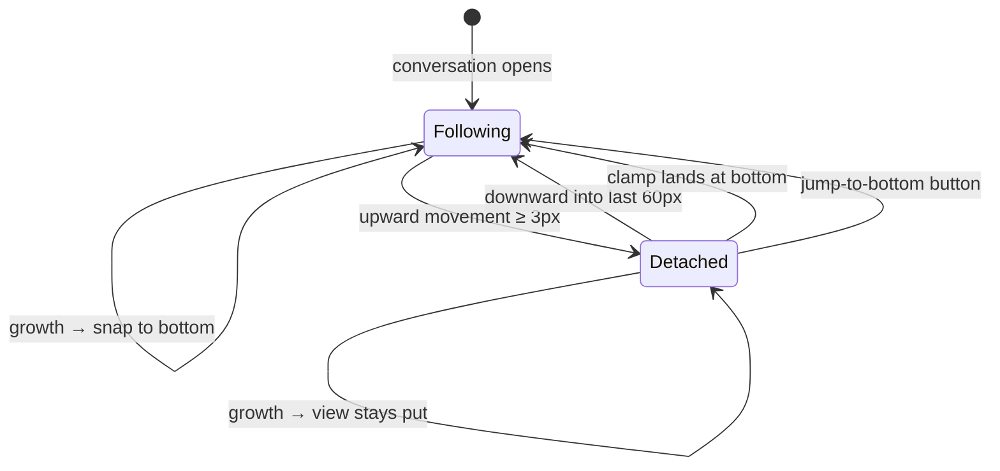

# The scroll model

How the conversation view decides whether it is following the bottom, what it treats as the user's intent, and how it moves.

## Summary

The conversation view is either **following** — glued to the bottom, moving whenever content grows — or **detached** — parked where the user put it, never moving on its own. The state is decided by geometry: where scroll positions land, not which device produced them. Scrolling up detaches; scrolling down into the near-bottom zone re-attaches; content getting shorter under a parked view that forces it to the bottom re-attaches too, because there is nothing left below to read. While following, growth is answered with snaps; deliberate moves (send, the jump buttons, re-attach catch-up) are glides that any upward scroll cancels instantly.

> Technical note: this is a geometric model, in the spirit of Streamdown's pinned scroll. Programmatic moves either land exactly at the bottom (follows) or begin by explicitly detaching (jumps to a reading position), so their scroll events never _look like_ user intent, and no bookkeeping of expected positions, timers, or grace periods is needed to tell the user's scrolls apart from the product's. See `src/lib/utils/scroll/stickToBottom.ts`.

## The simple case

A reply is streaming and the view is following. Each time the reply grows, the view moves down in the same frame, keeping the newest line just above the clearance. The user rolls the wheel up: from the first few pixels of upward movement the view is theirs — it stops moving, and the reply keeps growing below the fold. When they scroll back down and come within 60px of the bottom, the view re-attaches and glides the last stretch closed; from then on it follows again.

## The interaction, event by event

The scroll model underlies every phase of a turn; the phases themselves are described per-feature. What is fixed here is the classification of movement, which applies identically in all of them:

- **Upward movement detaches — when the user made it.** Any scroll event whose position is above the previous one counts toward detaching; 3px of accumulated upward movement is enough. This covers wheel, trackpad, scrollbar drags, touch drags and momentum, and keyboard (PageUp, Home, arrow keys) — anything that actually moves the view up with a gesture behind it. Gestures that do not move the view (pinch-zoom, horizontal pans, wheeling inside a code block that scrolls itself, touches in the navigation edge zone that the drawer claims) change nothing, because they produce no upward movement of the conversation. An upward move with _no_ gesture behind it while following is the browser's own doing and is undone in the same instant, before anything paints; while detached it is left alone.

  > Technical note: Safari clamps a scroller's position synchronously while DOM nodes are being swapped — every streamed token that replaces a paragraph, a keyed re-render, hydration — and then reports the clamp as a scroll event. Chromium defers the same clamp to layout, where the replacement node already exists, so it never fires. Without the gesture rule, Safari would detach on every such event: conversations would open at the top and stop following the moment a reply outgrew its reservation (both were true before this rework's Safari pass). Gestures are stamped from wheel, touch, keyboard, and scrollbar (mousedown on the scroller) input; a user-attributed scroll event extends the stamp, so a touch flick's momentum stays the user's for its whole run. See `GESTURE_CHAIN_MS` in `src/lib/utils/scroll/stickToBottom.ts`.

- **Downward movement into the near-bottom zone re-attaches.** A detached view that moves down to within 60px of the bottom re-attaches and glides the remaining gap closed. Downward movement that stops higher than that leaves the view detached.
- **A clamp re-attaches.** When content gets shorter (a reply collapses, a branch switch lands on a shorter alternative) or the viewport gets taller (window resize, virtual keyboard closing) and the browser forces a parked view to the new bottom, the view re-attaches: it is at the bottom and there is nothing below to read, so following is the only sensible continuation.
- **Growth above a detached reader does not move their text.** When images or markdown finish rendering above the viewport while the user reads detached, the browser's scroll anchoring compensates, and the text under their eyes stays put. The compensation is not treated as the user scrolling down — it never re-attaches.

### Moves the product makes

- **Snap.** While following, growth moves the view to the new bottom instantly, one frame after the growth. There is no easing during streaming: motion tracks content exactly.

  > Technical note: the one-frame deferral is deliberate. A user scroll in the same frame as growth dispatches its scroll event before animation frames run, so the user's detach always wins over the pending snap; a synchronous snap could overwrite their movement. In hidden tabs (throttled frames) and for reduced-motion users the snap is written synchronously instead.

- **Glide.** Sends (on fine pointers), the jump buttons, and re-attach catch-up ease toward their target. The target is re-read continuously, so a glide during streaming lands at the live bottom, never short of it. A glide more than 2500px long teleports to 1200px out and glides the rest. Any upward wheel movement or touch drag during a glide cancels it and detaches immediately — the product never fights the user for the scrollbar.
- **Never on its own.** Outside of following and an explicitly requested glide, the product does not move the view. There are no periodic corrections and no "helpful" repositioning.

## Modifiers

| Modifier                        | At the start                                                                                                               | Changed during                                                                                   |
| ------------------------------- | -------------------------------------------------------------------------------------------------------------------------- | ------------------------------------------------------------------------------------------------ |
| Touch device (coarse pointer)   | Sends snap instead of glide (see [sending a message](../features/sending-a-message.md))                                    | n/a — pointer kind is per-action                                                                 |
| Reduced motion                  | Every glide becomes a snap                                                                                                 | Takes effect on the next move                                                                    |
| Hidden tab                      | Follows are synchronous snaps; glides complete instantly                                                                   | Takes effect on the next move; returning to the tab never replays motion                         |
| Read-only / shared conversation | Same model; there is simply no streaming to follow                                                                         | n/a                                                                                              |
| Artifact panel open             | Same model; the conversation column is narrower, which can change content heights (reflow follows the normal growth rules) | Reflow while following snaps to the bottom; while detached, anchoring keeps the reading position |

## Cancel and interrupt

- **Stop button:** ends streaming; the scroll state (following or detached) is untouched. A following view simply stops receiving growth.
- **User does something else mid-way:** scrolling up detaches at any time, during any programmatic move, with ≤3px of movement; there is no moment where the product refuses to let go.
- **Clean complete:** the stream ending changes nothing about scroll state; see [streaming and reading](../features/streaming-and-reading.md#settling).
- **Environment failing:** network loss or a failed request stops growth; scroll state is untouched. A hidden tab keeps following synchronously, so returning to the tab shows the live bottom with no catch-up animation.
- **Page going away:** scroll state is not persisted. A reload lands the conversation at the bottom, following (see [conversations and loading](../features/conversations-and-loading.md)).
- **Something else changing the target:** shrinking content under a parked view either leaves it exactly in place (nothing below the fold was removed) or clamps it to the bottom and re-attaches (see clamp, above). Growth above a detached reader is compensated (see scroll anchoring, above).
- **Input channel changing:** the model reads positions, not devices, so switching between wheel, scrollbar, keyboard, and touch mid-interaction needs no special handling. The virtual keyboard is covered in [composer, viewport and gutter](../cross-cutting/composer-viewport-gutter.md).

## Interactions with other systems

In the fixed order: the **composer's clearance** defines where "the bottom" visually is — the last line rests on top of it (see cross-cutting). The **viewport** resizing re-follows when following, clamps when it must (above). **Reduced motion and hidden tabs** degrade glides to snaps (above). The **gutter** does not affect the model. **Shared conversations** use the identical model. The **artifact panel**'s code view uses the same controller with the same rules, minus turns and buttons.

## Edge cases

- Wheeling up when the conversation is shorter than the view does nothing — there is nothing to scroll, and the view stays following, so the first overflow later follows normally.
- Scrolling down to the bottom with the scrollbar re-attaches even though no wheel or touch was involved; only positions matter.
- A detached view exactly 60px from the bottom that receives growth stays detached and stays put; the zone is entered by moving, not by the bottom moving away.
- iOS rubber-banding past the bottom is clamped before classification: a bounce is never read as intent in either direction.

## Open questions and verification

Verified against the commit that introduced this document (see `git log -- docs/scroll`), by the automated suite in `src/lib/utils/scroll/__tests__/stickToBottom.svelte.test.ts` (detach, re-attach, clamp, anchoring-compensation, glide-cancel, and fuzzed interleaving cases). Open: whether 3px of accumulated upward drift is the right detach threshold on high-resolution trackpads that emit sub-pixel jitter while resting — the automated suite cannot simulate resting-hand jitter faithfully; needs a hand pass on a haptic trackpad.
