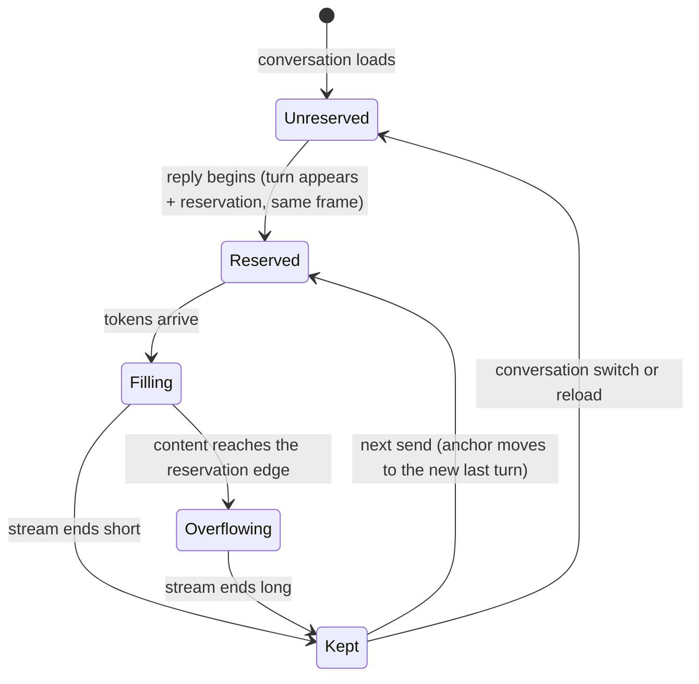

# The turn reservation

How the space a reply streams into is created, why nothing moves while it fills, and where the space goes afterwards.

## Summary

When a reply begins, its turn — the sent message and the reply together — becomes **the anchored turn** and is given a minimum height: the height of the view, minus 50px of breathing room above and the clearance below. With the view at the bottom, the sent message therefore sits 50px below the top of the view, and everything below it is blank. The reply streams into that blank space. Because the space already belongs to the turn, filling it does not change the height of the page: nothing on screen moves, and there is no layout shift, for as long as the reply fits. Only when the reply outgrows the reservation does the page grow and the normal following take over. The unused remainder of a reservation stays as blank space after the reply ends; the anchor moves to the next turn on the next send and clears when the user leaves the conversation.

> Technical note: the reservation is a single CSS `min-height` on the last turn's group element, computed from three slowly-changing numbers (view height, anchor offset, clearance) — see `anchorMinHeight` in `src/lib/utils/scroll/geometry.ts`. Nothing measures or resizes anything per frame. This replaces the previous implementation — a spacer element after the messages whose height was re-measured and rewritten on every content resize — whose measurement loop was the recurring source of layout shifts. A turn's group only ever _has_ or _does not have_ a `min-height`; content growth inside it is invisible to layout outside it.

## The simple case

The user sends "Explain monads" in an ongoing conversation. The view glides down until the sent message sits 50px below the top, with blank space from there to the composer. The reply streams into the blank space, line by line; the sent message, the heading of the reply, and the scrollbar do not move at all. The reply turns out long: when it reaches the clearance, the page starts growing and the view follows, exactly as described in [the scroll model](scroll-model.md). When the stream ends, the view rests wherever following left it.

## The interaction, event by event

- **Arming.** The user submits. Nothing is reserved yet — the exchange has not appeared.
- **Anchoring.** The new turn appears (in the same instant as, or shortly after, the submit — attachments are encoded first) and immediately becomes the anchored turn with its reservation in place. Both arrive in the same frame: the turn is never visible un-reserved. The previously anchored turn, no longer last, keeps nothing — but since the new reservation opens below it, nothing above the new turn moves.
- **Filling.** The reply grows inside the reservation. The page height is constant; a following view does not move; a detached view does not move; the scrollbar thumb does not move or resize. This phase lasts until the turn's content reaches the reservation's edge.
- **Following.** Content past the reservation grows the page; the scroll model takes over. The transition is seamless — the first pixel past the edge behaves exactly like every later one.
- **Settling.** The stream ends. The reservation is _not_ removed: a short reply leaves blank space below it, and the view stays exactly where it is. Removing the reservation here would yank the settled view — the blank space is the price of stillness, and it also keeps the sent message's reading position stable if the user scrolls back up.

## Modifiers

| Modifier           | At the start                                                                                                          | Changed during                                  |
| ------------------ | --------------------------------------------------------------------------------------------------------------------- | ----------------------------------------------- |
| Touch device       | Same reservation; the move to the anchor is a snap, not a glide                                                       | n/a                                             |
| Reduced motion     | Same reservation; the move to the anchor is a snap                                                                    | n/a                                             |
| Hidden tab         | Reservation and fill proceed; nothing needs to move anyway                                                            | Returning shows the filled state                |
| Read-only / shared | No streaming, so no turn ever becomes anchored: loaded conversations have no reservations and no trailing blank space | n/a                                             |
| Artifact panel     | The narrower column makes content taller; the reservation formula uses the view's height, which is unchanged          | Reflow inside the reservation is absorbed by it |

## Cancel and interrupt

- **Stop button:** streaming ends early; the reservation is kept, like any settle. The blank remainder is larger.
- **User does something else mid-way:** scrolling up during fill detaches, and — because the page height is constant during fill — their reading position is perfectly still while the reply keeps filling below. Sending again replaces the anchor: the new last turn gets the reservation, the old one keeps its actual content height plus nothing (its `min-height` no longer applies since it is no longer last); the swap happens below the new turn's top, so the reader sees no motion above.
- **Clean complete:** see Settling.
- **Environment failing:** a failed or aborted request settles the turn with whatever arrived; reservation kept.
- **Page going away:** reservations are session state. After a reload, no turn is anchored — the loaded conversation has no trailing blank space, and the view simply sits at the bottom of real content. This is deliberately different from within-session behavior and mirrors what major chat products do.
- **Something else changing the target:** regenerate collapses the old reply _inside_ the reservation — the box holds its size, so the collapse moves nothing anywhere (see [regenerating and branches](../features/regenerating-and-branches.md)). A branch switch to a different user message makes a different turn last; the reservation no longer applies, and shrinkage follows the clamp rule of the scroll model.
- **Input channel changing:** the virtual keyboard closing enlarges the view; the reservation is recomputed from the new height and the anchored message keeps its place 50px below the top (both the view and the reservation grew by the same amount). See [composer, viewport and gutter](../cross-cutting/composer-viewport-gutter.md).

## Interactions with other systems

**Composer:** the reservation subtracts the live clearance, so a composer that grows mid-turn (a long draft) shrinks the reservation by the same amount it adds padding below — total page height is unchanged and nothing moves, for as long as the reservation still exceeds the turn's content; content is never occluded either way. **Viewport:** resizes recompute the reservation from the new height; a following view re-snaps, keeping the anchor position. **Reduced motion:** unaffected — the reservation produces stillness, which is the point. **Gutter:** unaffected. **Shared conversations:** never anchored. **Artifact panel:** its code view has no turns and no reservations.

## Edge cases

- **First turn of a fresh conversation** is anchored like any other: the first message sits near the top with blank space below — the standard "new chat" feel. (Before this rework the first exchange was special-cased to scroll plainly; it no longer is.)
- **A sent message taller than the view** exceeds its reservation by itself; the reservation is inert and behavior is plain following. You see the tail of your message, and the reply streams in below it.
- **A resumed conversation** (a reply parked mid-stream, picked up again) anchors the resumed turn when streaming resumes: the continuation streams into a reservation exactly as a fresh reply would.
- **Regenerating in a freshly loaded conversation** anchors that turn at the moment of regeneration — the reservation appears in the same frame the old reply collapses, so the collapse is absorbed and the view does not jump even though the turn was never anchored before.
- The reservation applies only while its turn is the **last** turn. If a branch switch makes an older turn last, no reservation applies to it unless it is the anchored turn itself (switching back to the anchored branch restores its reservation).

## Open questions and verification

Verified against the commit that introduced this document, by `src/lib/utils/scroll/__tests__/chatScroll.svelte.test.ts` (anchor position, constant-height fill with a zero layout-shift probe, seamless handoff, kept-after-settle, regenerate-inside-reservation, clearance coupling). Open: whether the kept blank space after very short replies reads as intentional to users on small phone viewports, where the reservation is most of a screen — a product-taste question for the hand pass, not a correctness one.
